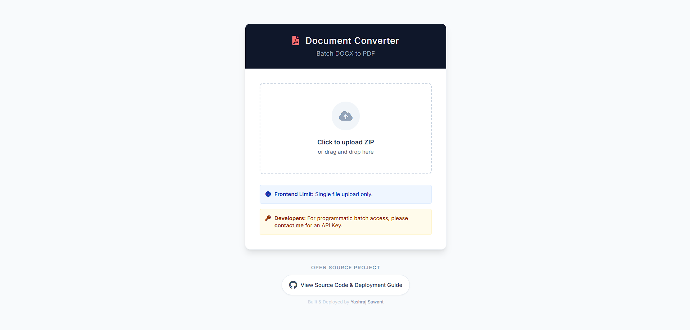

# Docx to PDF Converter Service

## 🌐 Live Demo

**Try it now:** [https://your-demo-url.com](https://docx.yashrajsawant.com/)


*Upload your .docx files and convert them to PDF with a simple, clean interface*

---

A robust, containerized microservice for batch converting Microsoft Word documents (`.docx`) to PDF. Built with **FastAPI**, **Celery**, and **PostgreSQL**.

## 🚀 Features

* **Batch Processing:** Upload a single `.zip` file containing multiple `.docx` files.
* **Asynchronous Architecture:** Uses Celery workers to handle heavy conversion tasks in the background without blocking the API.
* **Secure API:** Protected via `x-api-key` header authentication.
* **Real-time Status:** Polling endpoints to check job progress (Pending, Processing, Completed, Failed).
* **Built-in UI:** Includes a clean, responsive frontend for easy user interaction.
* **Dockerized:** Fully containerized setup with Docker Compose.

## 🛠️ Tech Stack

* **Backend:** FastAPI (Python 3.10+)
* **Worker:** Celery + Redis
* **Database:** PostgreSQL
* **Frontend:** HTML5, TailwindCSS, JavaScript (served via Jinja2 templates)
* **Containerization:** Docker & Docker Compose

---

## ⚙️ Installation & Setup

### 1. Clone the Repository

```bash
git clone https://github.com/YOUR_USERNAME/Docx-Converter-Service.git
cd Docx-Converter-Service
```

### 2. Configure Environment Variables

This project requires a `.env` file to manage secrets and API keys. This file is **ignored** by Git for security.

Create a `.env` file in the root directory:

```bash
nano .env
```

Paste the following configuration (Change the keys to your own secure values):

```env
# --- API SECURITY ---
# Comma-separated list of ALL allowed keys (Admin + Public)
API_KEYS=your_public_key_here,your_secret_admin_key_here

# The specific key injected into the Frontend UI (Must match one above)
PUBLIC_API_KEY=your_public_key_here

# --- INFRASTRUCTURE ---
DATABASE_URL=postgresql://user:password@db:5432/converter_db
CELERY_BROKER_URL=redis://redis:6379/0

# --- APP CONFIG ---
PROJECT_NAME="Docx Converter Service"
SHARED_DIR=/data
```

### 3. Run with Docker

Build and start the services:

```bash
docker-compose up --build -d
```

The service will be available at: **http://localhost:8000**

---

## 📖 API Documentation

All API endpoints require the `x-api-key` header.

### Authentication

| Header | Value | Description |
| :--- | :--- | :--- |
| `x-api-key` | `your_secure_key` | Required for all operations |

### Endpoints

#### 1. Submit Job

**POST** `/api/v1/jobs/`

* **Body:** `form-data` with key `file` (must be a `.zip`).
* **Response:**

```json
{
  "job_id": "59e8038c-adf8-4fba-8242-d7393bad32c7",
  "status": "PENDING"
}
```

#### 2. Check Status

**GET** `/api/v1/jobs/{job_id}`

* **Response:**

```json
{
  "job_id": "59e8038c-adf8-4fba-8242-d7393bad32c7",
  "status": "COMPLETED"
}
```

#### 3. Download Results

**GET** `/api/v1/jobs/{job_id}/download`

* Returns the converted `.zip` file containing PDFs.

---

## 📂 Project Structure

```
.
├── app/
│   ├── api/            # API Route definitions
│   ├── core/           # Config and Database setup
│   ├── models/         # SQLAlchemy Database Models
│   ├── services/       # Business logic (Storage, etc.)
│   ├── templates/      # Frontend HTML (Jinja2)
│   ├── tasks.py        # Celery Worker tasks
│   └── main.py         # App Entrypoint
├── .env                # Secrets (Not in Git)
├── .gitignore          # Git ignore rules
├── docker-compose.yml  # Container orchestration
├── Dockerfile          # Image build instructions
└── requirements.txt    # Python dependencies
```

## 🛡️ Security Notes

* **API Keys:** Keys are managed via the `.env` file. Do not commit real keys to GitHub.
* **Frontend Injection:** The "Public" key is injected into the frontend `index.html` at runtime by the server. This allows you to rotate keys without rebuilding the Docker image code.

## 📄 License

MIT
